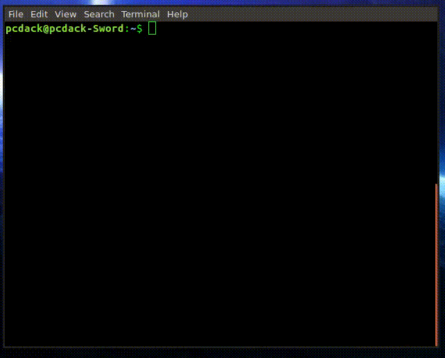
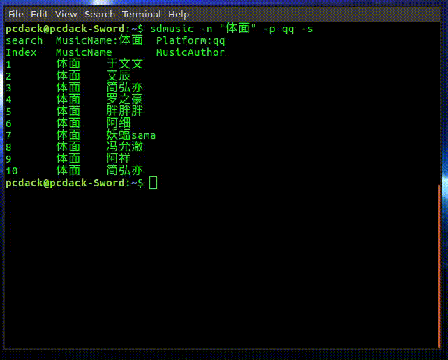

# SDMusic多平台音乐搜索下载工具

```shell
 ______     _____     __    __     __  __     ______     __     ______    
/\  ___\   /\  __-.  /\ "-./  \   /\ \/\ \   /\  ___\   /\ \   /\  ___\   
\ \___  \  \ \ \/\ \ \ \ \-./\ \  \ \ \_\ \  \ \___  \  \ \ \  \ \ \____  
 \/\_____\  \ \____-  \ \_\ \ \_\  \ \_____\  \/\_____\  \ \_\  \ \_____\ 
  \/_____/   \/____/   \/_/  \/_/   \/_____/   \/_____/   \/_/   \/_____/

```


Search && Download Music Cli
version 0.03a

语言：Python3
支持的搜索和下载平台：网易，QQ，酷狗，虾米，一听
支持的系统：理论上支持所有的系统，已测试系统Linux(Arch,Ubuntu,Mac(网友测试，十分感谢))

## 功能清单
- [1] 搜索
- [1] 下载
- [1] 歌词
- [1] 专辑图片下载与嵌入(*在下载时指定\-a参数,实现此功能依赖你电脑的ffmpeg*)
- [ ] 批量下载

## 安装

### 方法一

```shell
pip3 install sdmusic
```

### 方法二

```shell
git clone git@github.com:pcdack/SDMUSIC.git
cd SDMUSIC/
python3 setup.py install
```

## 使用


### 搜索命令

```shell
sdmusic -n "体面" -s
```
**可选参数**
\-p[platform]:可以指定搜索平台{netease(网易:默认)，qq,xiami(虾米),kugou(酷狗),1ting(一听)}
例子
```shell
sdmusic -n "体面" -p qq -s
```
\-g[page]:指定搜索的页面为第几页默认为第一页，如果第一页没有找到相关的歌曲，可以指定移动到第二页
```shell
sdmusic -n "体面" -p qq -g 1 -s
```

\-o[output]:指定输出路径(*只有在指定为下载是有效*)

\-l[lyric]:下载歌词(*只有在指定为下载是有效,不支持一听平台*)

\-a[album]:下载并嵌入专辑图片,专辑名字，作者名字等信息，全平台适用




### 下载命令

> 可选参数与搜索命令一样

很简单只要把上面的s参数改为d，然后用\-i在去指定你要下载那一条音乐

例如
```shell
sdmusic -n "体面" -p qq -s
```
在命令行的结果为
```shell
Index   MusicName       MusicAuthor
1       体面    于文文
2       体面    艾辰
3       体面    简弘亦
4       体面    罗之豪
5       体面    胖胖胖
6       体面    阿细
7       体面    妖蝠sama
8       体面    冯允澈
9       体面    阿祥
10      体面    简弘亦
```
我们如果想下载第一个音乐，那么
> 技巧使用键盘的上键更改即可

```shell
sdmusic -n "体面" -p qq -d -i 1
```
回车就可下载


Enjoy!
